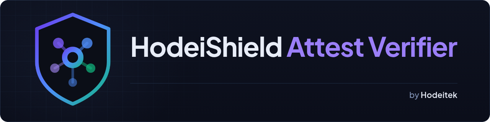

<p align="center"></p>

# Verify a HodeiShield attestation yourself

[](https://github.com/Hodeitek/hodeishield-attest-verifier/actions/workflows/live.yml)
[](https://github.com/Hodeitek/hodeishield-attest-verifier/actions/workflows/ci.yml)
[](https://github.com/Hodeitek/hodeishield-attest-verifier/releases)
[](LICENSE)

The offline verifier for [HodeiShield](https://hodeishield.com) posture
attestations, published by [Hodeitek](https://hodeitek.com), so that you do
**not** have to take our word for one. No credentials, account or cooperation
needed.

Step-by-step guides: [Spanish](https://docs.hodeishield.com/integrations/attest-verifier/),
[English](https://docs.hodeishield.com/en/integrations/attest-verifier/).

## The short version

What an organisation shares with you is a **URL**, not a file:
`https://app.hodeishield.com/api/public/attest/<slug>`, or just the `<slug>`,
which is the last part of that URL. Fetch the document from it right before you
verify: a document is valid for at most one hour, so a copy saved earlier, or
one forwarded to you as a file, will fail the freshness check however genuine
it is.

The attestation and the signing key are served by
[app.hodeishield.com](https://app.hodeishield.com). `-f` makes `curl` fail on an
HTTP error instead of saving the error page as `att.json`.

```bash
curl -fsS https://app.hodeishield.com/api/public/attest/talmaren-payments -o att.json
curl -fsS https://app.hodeishield.com/api/public/attest/keys              -o jwks.json

bash scripts/attest/verify-attestation.sh \
  --attestation att.json --jwks jwks.json \
  --expect-slug talmaren-payments --expect-issuer https://app.hodeishield.com
```

`talmaren-payments` is a demonstration organisation with fictitious data, kept
so that you can try the tool. It is not a promise: a demo subject can be
retired, and then the endpoint answers 404. Substitute the slug of whichever
organisation's attestation you were given. Always pass `--expect-issuer`; the
document names its own issuer, and only you can say which one you trust.

## What you are verifying

A posture attestation is a short document, signed by HodeiShield, stating how
far an organisation has got with frameworks such as ISO 27001 or NIS2 at a given
moment. A supplier, their Trust Center on HodeiShield or their answer to a
security questionnaire gives you the **link** to it,
`https://app.hodeishield.com/api/public/attest/<slug>`, or the slug alone. The
slug is the last part of that URL: in
`https://app.hodeishield.com/api/public/attest/talmaren-payments` it is
`talmaren-payments`, and it is the value you pass to `--expect-slug`. A Trust
Center badge carries the same link in its `Link` response header (see
[§4.9 of the verification document](docs/security/attest-verification.md#49-checking-an-embedded-badge-against-the-attestation)).

Each document is valid for at most one hour after it is generated, so what you
verify is the copy you fetch from that URL, not a file someone sent you: a file
forwarded by email or attached to a questionnaire will usually be older than an
hour by the time you check it, and the verifier rejects it as too old or
expired. If you were sent only a file, ask for the link. This tool tells you
whether the document you fetched is genuine, unaltered, current and about the
organisation you think. It is a verifier you can read and run yourself, and the documentation
here explains exactly what a `VERIFIED` result does and does not mean; §6 of it
says what the tool cannot tell you.

HodeiShield issues these attestations. An organisation that wants to publish its
own starts at [hodeishield.com](https://hodeishield.com).

## What you need installed

| | |
|---|---|
| `bash` ≥ 4 | This is bash, not POSIX `sh`. |
| **`openssl` ≥ 3.5** | ML-DSA (FIPS 204) support landed in 3.5. Check with `openssl list -signature-algorithms \| grep -i ml-dsa-65`. If that prints nothing, upgrade — a failure there is a limit of your tooling, not evidence against the document. LibreSSL (the `openssl` on macOS, or Homebrew's `libressl`) has no ML-DSA whatever its version number; the verifier checks this itself, says so and exits 2. If you cannot upgrade, use the [container route](#run-it-without-installing-anything). |
| **`python3`** | Required in practice. The endpoint serves a *detached* JWS, so the signed bytes must be re-derived from the JSON you can read. Standard library only. |
| `curl` | Only to fetch the two files above. Verification itself is offline. |
| `jq` | Only for `--status-list` (revocation checking). |

`xxd` is used when present and is not required.

## Run it without installing anything

This is the supported route on macOS, Windows and Ubuntu 24.04 LTS, whose
OpenSSL and bash are too old or absent for the verifier. The only thing your
machine needs is Docker or Podman, plus `curl` to fetch the two files (`curl`
ships with macOS, Windows 10 and later, and WSL).

From the repository root, fetch the two files, then run one container command:

```bash
curl -fsS https://app.hodeishield.com/api/public/attest/talmaren-payments -o att.json
curl -fsS https://app.hodeishield.com/api/public/attest/keys              -o jwks.json
```

<!-- container-route -->
```bash
docker run --rm -v "$PWD":/work:ro -w /work \
  debian:trixie-slim@sha256:a99cfc517144bc59b1978475ec53b46ecabec7e43635402ee5b77cc54cd1b20a \
  bash -c 'apt-get update -qq >/dev/null && apt-get install -y -qq --no-install-recommends openssl python3 jq >/dev/null || exit 2; exec bash scripts/attest/verify-attestation.sh "$@"' _ \
  --attestation att.json --jwks jwks.json \
  --expect-slug talmaren-payments --expect-issuer https://app.hodeishield.com
```

The container mounts your files read-only, installs OpenSSL, `python3` and `jq`
inside itself, and runs the same script. If that install fails (for example
because the container has no network), the command exits 2, "could not check",
so the exit codes are exactly the native ones: the table in
[Exit codes](#exit-codes--the-distinction-matters).

To check revocation as well (see [Revocation](#revocation)), fetch the status
list and its key set too, and run the same container with `--status-list`. Its
exit codes are the `--status-list` table, including 3 for "unknown":

```bash
curl -fsS https://app.hodeishield.com/api/public/attest/status      -o status.json
curl -fsS https://app.hodeishield.com/api/public/attest/status-keys -o status-jwks.json
```

<!-- container-route-status -->
```bash
docker run --rm -v "$PWD":/work:ro -w /work \
  debian:trixie-slim@sha256:a99cfc517144bc59b1978475ec53b46ecabec7e43635402ee5b77cc54cd1b20a \
  bash -c 'apt-get update -qq >/dev/null && apt-get install -y -qq --no-install-recommends openssl python3 jq >/dev/null || exit 2; exec bash scripts/attest/verify-attestation.sh "$@"' _ \
  --status-list --status status.json --status-keys status-jwks.json \
  --attestation att.json --jwks jwks.json \
  --expect-slug talmaren-payments --expect-issuer https://app.hodeishield.com
```

- **Podman:** the same commands with `podman` instead of `docker`. On SELinux
  hosts (Fedora, RHEL) mount with `-v "$PWD":/work:ro,Z`.
- **Windows:** install Docker Desktop and run the commands above from a WSL
  terminal, in the cloned repository. PowerShell quotes differently, so no
  PowerShell variant is offered.

The image is the upstream Debian 13 image, pinned by digest: the same one CI
tests on, so a rebuilt tag cannot change what you run. The digest pins the
base image; `openssl`, `python3` and `jq` come from Debian 13's archive when the
command runs, so they carry Debian's current security updates. An official signed image
is tracked in [#22](https://github.com/Hodeitek/hodeishield-attest-verifier/issues/22).

## Exit codes — the distinction matters

Posture mode (the default, as above):

| Code | Meaning |
|---|---|
| **0** | Verified. The signature holds and every requested check passed. |
| **1** | **Check failed.** Something did not hold. Do not rely on the document. |
| **2** | **Could not check.** Missing tool, an `openssl` that cannot do ML-DSA, unreadable input, unknown key. This is *not* a statement about the document — do not read it as failure. |

A genuine document that is only out of date also exits 1: it is not one to rely
on. Its last line tells it apart from a tampered or invalid one. It starts with
`EXPIRED — the signature is valid` and gives the date the document expired and
the command to fetch a new one. Any other failure ends with
`VERIFICATION FAILED — … Do not rely on this document.` The `EXPIRED` line only
appears when the signature verified and age or expiry was the only problem.

`--status-list` mode (revocation, see below):

| Code | Meaning |
|---|---|
| **0** | Good. If a document was given, its posture checks passed **and** it is not revoked. |
| **1** | **Revoked**, or the posture check of the document you gave failed. |
| **2** | **Could not check.** Bad flags, a missing tool, or a status list that could not be fetched or read. |
| **3** | **Unknown.** The list was obtained but does not verify, is stale, was rolled back, or names its own signer. This is neither "good" nor "revoked". |

Never test `$? -ne 0` and treat the result as one outcome. In `--status-list`
mode that collapses "revoked" (1), "could not check" (2) and "unknown" (3) into
the same branch, and the one you most need to tell apart from a clean result is
the one you would lose. Conflating these is the single most common way to
misread a verifier. They are kept apart deliberately, everywhere in the script.

### Revocation

A signed status list says whether the key that signed a document, or the
organisation it was issued for, has been withdrawn. It is a separate document
with a separate key set, and it is optional: checking it only adds information.
Verify the attestation and its revocation status in one run:

```bash
curl -fsS https://app.hodeishield.com/api/public/attest/status      -o status.json
curl -fsS https://app.hodeishield.com/api/public/attest/status-keys -o status-jwks.json

bash scripts/attest/verify-attestation.sh --status-list \
  --status status.json --status-keys status-jwks.json \
  --attestation att.json --jwks jwks.json \
  --expect-slug talmaren-payments --expect-issuer https://app.hodeishield.com
```

`--jwks` and `--status-keys` are different key sets and are never
interchangeable. What the list can and cannot tell you is in
[§7.1 of the verification document](docs/security/attest-verification.md#71-checking-key-or-subject-revocation-yourself).

## What the output shows

The checks print as `PASS`, `WARN` and `FAIL` lines, in numbered sections, with
the last line giving the verdict. What the document *says* (its overall band
and, for each framework, its name and band, plus the subject, `generatedAt`,
`lastCheckedAt` and visibility) is printed in an "Attested content" block just
before the verdict, and only when the run ends `VERIFIED` (or `GOOD` in
`--status-list` mode). A document that is tampered, expired, revoked, of unknown
status, or that could not be checked shows none of it: the output says
`attested content withheld: this document did not verify` instead. The sections
above still print what is needed to see why: which check failed, the `kid` and
whether it can be derived from the key, the expected and found slug or issuer,
and the document's `generatedAt` and `expiresAt` for a freshness failure.

The full signed posture JSON is printed only with `--raw`, and under the same
rule: a document that does not verify never shows it, even with `--raw`.

## Convince yourself it can fail

A verifier that has only ever printed `PASS` has told you nothing. Each of these
must exit 1, and you should run them before trusting a `VERIFIED`:

```bash
# 1. Tamper with a signed field.
python3 -c "import json;d=json.load(open('att.json'));\
d['attestation']['claims']['overallBand']='advanced';\
json.dump(d,open('att-tampered.json','w'))"
bash scripts/attest/verify-attestation.sh --attestation att-tampered.json \
  --jwks jwks.json --expect-slug talmaren-payments ; echo "exit=$?"   # 1

# 2. Ask for the wrong subject.
bash scripts/attest/verify-attestation.sh --attestation att.json \
  --jwks jwks.json --expect-slug not-talmaren-payments ; echo "exit=$?" # 1

# 3. Add a member the signature does not cover.
python3 -c "import json;d=json.load(open('att.json'));\
d['attestation']['claims']['note']='not signed';\
json.dump(d,open('att-extra.json','w'))"
bash scripts/attest/verify-attestation.sh --attestation att-extra.json \
  --jwks jwks.json --expect-slug talmaren-payments ; echo "exit=$?"   # 1
```

The third case fails as `unsigned_member`: the signature covers a fixed set of
members, so anything else in the JSON is a statement nobody signed, and the
verifier rejects it rather than ignoring it.

`docs/security/attest-verification.md` §4.7 adds more, including a
header-reordering case and an issuer substitution. To run the full offline
rejection suite (keys generated at test time, no network), use
`bash tests/run.sh`.

## What a `VERIFIED` proves — and what it does not

Read **[§6 of the verification document](docs/security/attest-verification.md#6-what-a-verified-attestation-proves--and-what-it-does-not)**
before relying on any result. It is the section that matters most, and it is
longer than the commands on purpose.

The short form, so it is on this page too:

**It proves** that the document was signed by the holder of the published key,
that not one bit has changed since, that the timestamps inside it were not
altered after signing (the key holder can sign any timestamp — see §6), and that
the signature is post-quantum (ML-DSA-65, FIPS 204).

**It does not prove** that the claims inside are true. The maturity bands are
*our* scoring of evidence supplied by the organisation — a signed document
containing a wrong claim is a signed wrong claim. It does not prove the key
belongs to Hodeitek (you are trusting the Web PKI for that one binding — pin the
key's `kid`, see [Pinning the key](#pinning-the-key)). It does not prove anything about accredited certification bodies.
And §6 item 8 states, without softening, that the signing key is held in
software rather than in an HSM, and what that means for you.

### Pinning the key

The fingerprint to pin is the key's `kid`. It is derived from the public key
bytes: `BASE64URL(SHA-256("hodei-shield.attest.kid.v1" || pub)[0..16])`, see
[§4.2 of the verification document](docs/security/attest-verification.md#42-the-kid-is-checked-not-trusted).
The verifier recomputes it from the key bytes, prints it on the `kid:` line, and
rejects a JWKS whose `kid` does not match its key. To compute it yourself from
a downloaded `jwks.json`, one value per key:

```bash
python3 -c 'import sys,json,base64,hashlib;[print(base64.urlsafe_b64encode(hashlib.sha256(b"hodei-shield.attest.kid.v1"+base64.urlsafe_b64decode(k["pub"]+"="*(-len(k["pub"])%4))).digest()[:16]).decode().rstrip("=")) for k in json.load(open(sys.argv[1]))["keys"]]' jwks.json
```

Compare the output with the `kid` you pinned. This repository does not yet
publish the current values.

## Where this comes from, and what is redacted

- `scripts/attest/verify-attestation.sh` is the same script we keep, byte for
  byte, at the same path in Hodeitek's private repository, where CI checks that
  the two copies never diverge. The HodeiShield service itself does not run
  this script: it verifies with its own TypeScript implementation of the same
  format, which is why an independent implementation you can read is worth
  having. Every release
  publishes a `SHA256SUMS` for the script and a Sigstore keyless signature
  bundle; see [Verifying a release](#verifying-a-release).
- `docs/security/attest-verification.md` is a **redacted public edition** of an
  internal document. The redactions are itemised at the bottom of that file, so
  you can judge them rather than take them on faith. No limitation was removed,
  shortened or softened; §3 (verifying an unrelated transport root CA) is
  omitted because it depends on files you do not have.
- References in the script's comments to paths like `app/src/lib/attest/…` are
  **provenance** — they say where a constant or a rule came from. They are not
  steps you are expected to follow. The same holds for references to
  `docs/architecture/specs/…` (the revocation design document) in the script's
  comments: that document is not public, and nothing the script prints points to
  it. Where a message sends you to a document, it is §7 or §7.1 of the public
  one, which covers what a verifier needs.

## Verifying a release

Download these four files from the GitHub release you are using:
`verify-attestation.sh`, `SHA256SUMS`, `SHA256SUMS.sigstore.json` and
`verify-attestation.sh.sigstore.json`. Then:

```bash
sha256sum -c SHA256SUMS

cosign verify-blob --bundle verify-attestation.sh.sigstore.json \
  --certificate-identity "https://github.com/Hodeitek/hodeishield-attest-verifier/.github/workflows/release.yml@refs/tags/<TAG>" \
  --certificate-oidc-issuer https://token.actions.githubusercontent.com \
  verify-attestation.sh

cosign verify-blob --bundle SHA256SUMS.sigstore.json \
  --certificate-identity "https://github.com/Hodeitek/hodeishield-attest-verifier/.github/workflows/release.yml@refs/tags/<TAG>" \
  --certificate-oidc-issuer https://token.actions.githubusercontent.com \
  SHA256SUMS
```

Replace `<TAG>` with the release tag. What changed in each release is in
[CHANGELOG.md](CHANGELOG.md). This proves that the file was built from
that tag of this repository by its release workflow, and that the signing was
logged in Rekor. The tag itself is signed; GitHub shows it as Verified. It does **not** prove the verifier is correct. Read it; that is
the reason it is a short, single, readable script.

## Tests and CI

- `shellcheck` runs on the shell scripts.
- `bash tests/run.sh` runs the offline acceptance suite: every case mints its own
  documents with a throwaway key and asserts both the exit code and the reason
  printed. It needs bash, OpenSSL ≥ 3.5, `python3` and `jq`, and no network.
- `bash tests/vectors.sh` runs the published, versioned test vectors in
  `tests/vectors/v1/`: fixed documents, TEST-ONLY keys, a fixed `--now` and the
  expected exit code and reason for each, so you can check another verifier
  against them. `tests/run.sh` runs them too; see `tests/vectors/v1/README.md`.
- `bash tests/mutants.sh` builds a copy of the verifier whose signature check
  always passes and shows the vectors that depend only on that check
  (`signature_only`) are accepted by it, so a verifier with a disabled
  signature check cannot pass the suite. `tests/run.sh` runs it too.
- Two jobs check that the verifier exits 2 ("could not check"), never 1, when
  its `openssl` cannot do ML-DSA: one with an OpenSSL older than 3.5, one with
  real LibreSSL in a digest-pinned Alpine image.
- `bash tests/container.sh` extracts both container commands from this README
  and runs them as written (live example, plus offline rejection and revocation
  cases); the "Container route" workflow does so with Docker and Podman.
- On every push, pull request and once a day (the "Live check" badge above),
  `bash tests/live.sh` runs the verifier against the production
  `talmaren-payments` attestation and the status list, exactly as above. A network outage is reported as a warning; a document
  that does not verify, a revoked or unknown status, or a 404 on the example is a
  failure.

## Reporting a problem

If the verifier cannot run or cannot check (exit 2, missing or old tooling, a
container route problem), open a public issue with the
[usage problem template](https://github.com/Hodeitek/hodeishield-attest-verifier/issues/new?template=usage-problem.yml).
Do not paste confidential data.

If any check here fails, or if you find a discrepancy between what a document
claims and what you can independently establish:

**security@hodeitek.com** — include the artefact, the exact command, and the
full output. A verification failure you can reproduce is a security report and
we will treat it as one. You can also report it privately through GitHub
(**Security** tab, **Report a vulnerability**); see [SECURITY.md](SECURITY.md).

## Licence

Licensed under the [Apache License 2.0](LICENSE). Copyright 2026 Hodeitek S.L.;
see [NOTICE](NOTICE). It is a verifier; you should be free to read it, run it,
modify it and integrate it into your own due-diligence tooling without asking.

HodeiShield® and Hodeitek® are registered trademarks of Hodeitek S.L.; the license grants no rights to them (Apache-2.0 §6).

To contribute, see [CONTRIBUTING.md](CONTRIBUTING.md) (commits carry a DCO
sign-off). To report a vulnerability, see [SECURITY.md](SECURITY.md).

## About

- [hodeishield.com](https://hodeishield.com) — HodeiShield.
- [app.hodeishield.com](https://app.hodeishield.com) — the HodeiShield application; where the attestations, keys and status list are served.
- [hodeitek.com](https://hodeitek.com) — Hodeitek, who publishes this repository.
